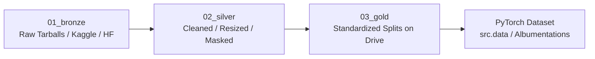

<!--
  Epic High-Level Design (HLD) Template: Research Track / ML Subsystem
  Location: docs/epics/E-<NNN>-<slug>/README.md
  Reference: Eugene Yan's ML Design Docs & Chip Huyen's ML Systems Design
-->

# Epic E-NNN: <Title of Research Track or Model Subsystem>

> **Status**: Draft | In-Review | Approved | In-Progress | Completed  
> **Lead**: Khang Nghiem  
> **Date**: YYYY-MM-DD  
> **Target Timeline**: QX YYYY  

---

## 1. Executive Summary

<1–2 paragraphs: What deep learning capability or research hypothesis does this Epic deliver? What is the clinical or real-world impact, and why is this being addressed now?>

---

## 2. Motivation & Problem Framing

- **Problem Statement**: <What clinical/diagnostic/computer vision problem is being tackled? e.g., Automated polyp segmentation in colonoscopy frames with low latency.>
- **Framing**: Supervised Segmentation / Self-Supervised Learning / Object Detection / Multimodal Classification.
- **Why Now**: <Clinical urgency, availability of new foundation models (SAM 2, YOLOv12), or new benchmark datasets.>

---

## 3. Scope & Boundaries

### In-Scope
- <Primary model family or architecture under investigation, e.g. SAM 2 Hiera with PEFT LoRA>
- <Target dataset(s) and Gold lake preparation>
- <Training pipeline execution on Google Colab Pro+>
- <Inference optimization and deployment target (e.g. Modal.com microservice)>

### Out-of-Scope
- <Explicit exclusions, e.g., Real-time edge hardware quantization (deferred to E-NNN)>
- <Clinical production EHR integration (handled in Fast-Diag)>

### Key Dependencies & Upstream Requirements
- Available dataset tier in Google Drive Medallion Lake (`src.config.paths.GOLD`)
- Base foundation model weights (e.g., Meta SAM 2 checkpoints)
- Compute: Colab Pro+ GPU allocation (A100 / L4 / T4)

---

## 4. Baselines & Success Criteria

> [!IMPORTANT]
> Never innovate without a benchmark. An experiment's value is defined by its delta over an established baseline.

### Benchmark Targets

| Metric | Published / Prior Baseline | Minimum Target | Stretch Goal | Evaluation Dataset / Split |
| :--- | :--- | :--- | :--- | :--- |
| **Dice Score / mIoU** | 0.81 (UNet baseline) | 0.86 | 0.90 | Kvasir-SEG test split |
| **mAP@50** | — | — | — | — |
| **Inference Latency** | 120ms (CPU) | < 40ms (T4 GPU) | < 25ms (T4 GPU) | Batch size = 1, 512x512 |
| **Trainable Params** | 100% (Full Fine-Tune) | < 5% (LoRA r=16) | < 2% (LoRA r=8) | PEFT Adapter |

---

## 5. Data Lake Strategy & Lineage

Data lineage follows the Medallion architecture hosted on Google Drive:



- **Bronze (`01_bronze`)**: Raw downloads (unmodified zips/tars from HuggingFace, Kaggle, or Hospital archives).
- **Silver (`02_silver`)**: Validated images, converted mask formats (e.g., binary 0/255 $\to$ 0/1), standardized coordinate bounds.
- **Gold (`03_gold`)**: Fixed train/val/test splits ready for Colab streaming or fast ephemeral caching. Import path via `src.config.paths.GOLD`.
- **Dataset Reference**: Catalogued in `src/config/catalog.py` and documented in `docs/medical_datasets_README.md`.

---

## 6. End-to-End System Pipeline

```mermaid
flowchart TD
    subgraph Storage [Google Drive / Cloud]
        GoldData[03_gold Dataset]
        Checkpoints[models/trained/{NNN}_{name}/]
        MLflowDB[(mlflow.db SQLite)]
    end

    subgraph Prototyping [Local / Colab]
        EDA[notebooks/{NNN}_{dataset}_{model}.ipynb<br/>Exploration & Visualization]
    end

    subgraph Training [Google Colab Pro+]
        Launcher[experiments/{NNN}_*/train.ipynb<br/>Colab Launcher]
        TrainScript[experiments/{NNN}_*/train.py<br/>Source of Truth]
        Lib[src/ Package<br/>pip install -e .]
        Launcher --> TrainScript
        Lib --> TrainScript
    end

    subgraph Serving [Deployment]
        ModalApp[deploy/sam2_modal/app.py<br/>Modal.com Serverless GPU]
    end

    GoldData --> EDA
    GoldData --> TrainScript
    TrainScript --> Checkpoints
    TrainScript --> MLflowDB
    Checkpoints --> ModalApp
```

---

## 7. Work Breakdown & Roadmap

### Reusable Modules (Features / LLDs in `src/`)
| Feature | Module Target | Description | Status |
| :--- | :--- | :--- | :--- |
| **[F-001](F-001-<slug>.md)** | `src/models/` | Base model wrapper & LoRA adapter integration | Planned |
| **[F-002](F-002-<slug>.md)** | `src/data/` | Medallion Gold dataset loader & Albumentations pipeline | Planned |
| **[F-003](F-003-<slug>.md)** | `src/training/` | Composite loss (BCE + Dice) & early stopping callback | Done |

### Experiments Roadmap (`experiments/`)
| Exp ID | Architecture / Model | Key Variation / Hypothesis | Target Metric | Status |
| :--- | :--- | :--- | :--- | :--- |
| `060` | SAM 2 Hiera Small | Full model fine-tuning with LoRA r=16 | Dice > 0.85 | Completed |
| `061` | SAM 2 Hiera Small | Decoder-only fine-tuning with LoRA r=32 | Dice > 0.86 | In-Progress |
| `062` | SAM 2 Hiera Small | Decoder-only fine-tuning with LoRA r=64 | Dice > 0.87 | Planned |

---

## 8. Definition of Done (DoD)

To close this Epic, the following criteria must be satisfied:

- [ ] **Benchmark Verified**: Best model candidate exceeds the baseline by the target margin on the held-out test split.
- [ ] **Exploration Preceded Formalization**: All architectures prototyped first in `notebooks/` before committing to `experiments/`.
- [ ] **Code Graduated**: Reusable data transforms, model heads, and loss functions graduated into `src/`.
- [ ] **Testing Green**: Local unit and integration test suite passing cleanly (`pytest tests -v`).
- [ ] **Reproducible Logging**: All runs tracked in SQLite MLflow database (`mlflow.db`) with logged parameters, metrics, and artifact references.
- [ ] **Weights Persisted**: Final best checkpoint (`best.pt` or PEFT adapter) safely saved to Google Drive (`DRIVE_ROOT/models/trained/{NNN}_{name}/`).
- [ ] **Deployment Validated** (if applicable): Inference script or Modal deployment verified on test inputs.

---

## 9. Related Documents

- **Dataset Catalog**: [src/config/catalog.py](../../src/config/catalog.py)
- **Path Resolver**: [src/config/paths.py](../../src/config/paths.py)
- **ML Testing Guide**: [docs/TDD_GUIDE.md](../TDD_GUIDE.md)
- **Medical Datasets Reference**: [docs/medical_datasets_README.md](../medical_datasets_README.md)