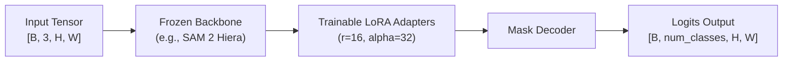

<!--
  Feature Low-Level Design (LLD) Template: ML Engineering & Architecture Spec
  Location: docs/epics/E-<epic>-<slug>/F-<n>-<feature-slug>.md
  Reference: SE4ML (Software Engineering for Machine Learning) & Google Rules of ML
-->

# Feature F-NNN: <Feature or Module Name>

> **Parent Epic**: [Epic E-NNN](../README.md)  
> **Target Module**: `src/<subpackage>/<module_name>.py` (e.g. `src/models/sam2_lora.py`)  
> **Author**: Khang Nghiem  
> **Status**: Draft | In-Review | Approved | Implemented | Graduated to `src/`  
> **Date**: YYYY-MM-DD  

---

## 1. Introduction & Motivation

<Concise narrative: What problem does this module solve? Why is this being built as a reusable library module in `src/` instead of staying inside a one-off notebook? What experiments or pipelines will consume it?>

---

## 2. Mathematical & Architectural Specification

### Theoretical / Mathematical Formulation
<State the mathematical equation, loss formulation, or algorithmic mechanism.>

For example:
$$\mathcal{L}_{total} = \lambda_{BCE} \mathcal{L}_{BCE}(y, \hat{y}) + \lambda_{Dice} \mathcal{L}_{Dice}(y, \hat{y})$$
$$\text{Where } \mathcal{L}_{Dice} = 1 - \frac{2 |y \cap \hat{y}| + \epsilon}{|y| + |\hat{y}| + \epsilon}$$

### Architecture Diagram


### Parameter Breakdown
| Submodule / Layer | Trainable? | Approx Parameters | Memory Footprint (FP32) |
| :--- | :--- | :--- | :--- |
| Image Encoder / Backbone | No (Frozen) | ~28.0 M | ~112 MB |
| LoRA Adapter Weights | Yes | ~0.5 M | ~2 MB |
| Prompt / Mask Decoder | Yes | ~4.0 M | ~16 MB |
| **Total** | — | **~32.5 M (13.8% Trainable)** | **~130 MB** |

---

## 3. Data & Tensor Interface Design

### Tensor Signatures

| Tensor Name | Shape | Data Type | Value Range | Description |
| :--- | :--- | :--- | :--- | :--- |
| `images` | `[B, 3, H, W]` | `torch.float32` | `[0.0, 1.0]` or normalized | Input batch of RGB frames |
| `masks` (GT) | `[B, 1, H, W]` | `torch.float32` | `{0.0, 1.0}` | Binary segmentation ground truth |
| `logits` (Pred) | `[B, 1, H, W]` | `torch.float32` | `[-inf, +inf]` | Raw unnormalized model predictions |
| `probs` | `[B, 1, H, W]` | `torch.float32` | `[0.0, 1.0]` | Post-sigmoid prediction probabilities |

### Python API Interface
```python
class ModelOrModule(nn.Module):
    def __init__(self, num_classes: int = 1, lora_rank: int = 16) -> None:
        ...

    def forward(self, x: torch.Tensor) -> torch.Tensor:
        """
        Args:
            x: Input tensor of shape (B, 3, H, W).
        Returns:
            Logits tensor of shape (B, num_classes, H, W).
        """
        ...
```

---

## 4. Colab Pro+ Hardware Profile & Resource Budget

Training runs exclusively on Google Colab Pro+ with Google Drive persistence.

### GPU Allocation Target
- **Primary GPU**: NVIDIA T4 (16GB) or L4 (24GB) or A100 (40GB)
- **Precision Mode**: Mixed precision (`torch.cuda.amp.autocast(dtype=torch.float16)`)

### VRAM Budget Estimation
| Component | Formula / Source | Estimated VRAM |
| :--- | :--- | :--- |
| Model Weights | Parameters $\times$ bytes per param | ~130 MB |
| Gradients | Trainable params $\times$ 4 bytes | ~18 MB |
| Optimizer States (AdamW) | $2 \times$ Trainable params $\times$ 4 bytes | ~36 MB |
| Activations (Batch Size = 8) | Forward intermediate tensors | ~2,500 MB |
| CUDA Workspace / Context | PyTorch overhead | ~800 MB |
| **Total Estimated Peak VRAM** | — | **~3.5 GB (Well within 16GB T4)** |

---

## 5. Quality Assurance & PyTorch TDD Plan

All components must satisfy adapted ML Test-Driven Development protocols (see `docs/TDD_GUIDE.md`) before integration.

### Test Matrix

| Test Layer | Test File | Test Case Name | Enforced Invariant |
| :--- | :--- | :--- | :--- |
| **Unit: Shape** | `tests/unit/test_models.py` | `test_forward_shape()` | Given `(2, 3, 256, 256)`, output shape is strictly `(2, 1, 256, 256)`. |
| **Unit: Loss** | `tests/unit/test_losses.py` | `test_loss_non_negative()` | Loss output is non-negative, finite, with zero NaN/Inf. |
| **Unit: Gradients** | `tests/unit/test_models.py` | `test_trainable_param_grads()` | Gradients exist for adapter parameters, but are `None` for frozen backbone. |
| **Unit: Device** | `tests/unit/test_models.py` | `test_device_placement()` | Module successfully transfers and executes on `cpu` and `cuda`. |
| **Integration: Loop**| `tests/integration/test_training.py` | `test_single_epoch_dry_run()` | 1 full epoch with batch size 2 on synthetic data completes with loss decrease. |

---

## 6. Model Checkpointing & Artifact Serialization

- **Artifact Format**: Standard PyTorch state dict (`.pt`) or PEFT adapter folder (`adapter_config.json`, `adapter_model.safetensors`).
- **Checkpoint Metadata Dictionary**:
  ```python
  checkpoint = {
      "epoch": epoch,
      "model_state_dict": model.state_dict(),
      "optimizer_state_dict": optimizer.state_dict(),
      "best_metric": best_val_dice,
      "config": config,
  }
  ```
- **Google Drive Storage Path**:
  Resolved dynamically via `src.config.paths`:
  `DRIVE_ROOT / "models" / "trained" / "{NNN}_{experiment_name}" / "best.pt"`

---

## 7. Code Graduation Checklist (Notebook $\to$ `src/`)

Reusable engineering modules follow the graduation lifecycle:

- [ ] **Phase 1: Exploration**: Prototype validated in `notebooks/{NNN}_*.ipynb` using ephemeral data on Colab `/content/`.
- [ ] **Phase 2: Library Extraction**: Clean logic extracted into `src/<subpackage>/<module>.py`.
- [ ] **Phase 3: Clean Imports**: Relies on relative or `from src.config.paths import ...` (zero `sys.path.insert` hacks).
- [ ] **Phase 4: Unit Testing**: Shape, loss, and gradient tests added to `tests/unit/`.
- [ ] **Phase 5: Local Suite Green**: Full test suite passes: `pytest tests -v`.
- [ ] **Phase 6: Experiment Consumption**: Experiment `experiments/{NNN}_*/train.py` imports the graduated module from `src`.

---

## 8. Risks, Numerical Hazards & Mitigation

| Hazard / Risk | Root Cause | Observable Symptom | Mitigation Strategy |
| :--- | :--- | :--- | :--- |
| **Loss NaN / Inf** | Log of zero in cross-entropy or division by zero in Dice | Training loss explodes to `NaN` | Add small epsilon $\epsilon = 10^{-7}$ inside denominator / clamping. |
| **GPU OOM** | Activation memory spikes with large input dimensions | `CUDA out of memory` | Use gradient checkpointing or reduce batch size with gradient accumulation. |
| **Silent Freeze** | Forgot to set `requires_grad=True` on adapter | Model loss does not change across epochs | Unit test checking `param.grad is not None` after backward pass. |
| **Drive I/O Bottleneck** | Reading thousands of small individual files over Drive FUSE | Epoch duration 10x slower than expected | Copy dataset zip/tar to Colab ephemeral `/content/` disk prior to training. |

---

## 9. References & Linked Experiments

- **Parent Epic**: [Epic E-NNN](../README.md)
- **Consuming Experiment**: `experiments/{NNN}_{dataset}_{model}/`
- **Exploration Notebook**: `notebooks/{NNN}_{dataset}_{model}.ipynb`